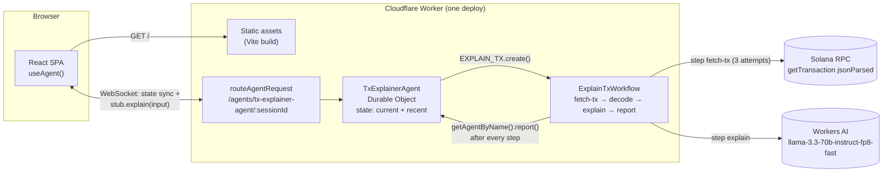

# cf_ai_solana_tx_explainer

Paste a Solana transaction link or signature. The app fetches it from Solana RPC, decodes it into a
structured breakdown (overview, SOL and token balance changes, instructions with nested inner
instructions, accounts, logs), and has Llama 3.3 on Workers AI explain what happened in plain
English. Everything runs in one Cloudflare Worker. No database, no auth, no wallet.

**Live:** https://cf-ai-solana-tx-explainer.asamadans.workers.dev

> **Screenshot:** _placeholder, add `docs/screenshot.png` and link it here._

## Architecture



1. The browser generates a random session ID (kept in `localStorage`) and connects to its own
   `TxExplainerAgent` instance with `useAgent`. Agent state syncs over the WebSocket.
2. Decode calls `agent.stub.explain(input)`. The agent re-validates the input, sets
   `status: "fetching"`, and starts an `ExplainTxWorkflow` instance.
3. Each workflow step is durable. After each one the workflow gets the agent stub with
   `getAgentByName` and calls `report(runId, patch)`. The agent `setState`s, and every connected tab
   re-renders: `FETCH → DECODE → EXPLAIN` progresses live.
4. A finished lookup is pushed to `recent` (max 10). Clicking one re-runs it.

## Assignment requirements → code

| Requirement | Where |
|---|---|
| **LLM** | Llama 3.3 (`@cf/meta/llama-3.3-70b-instruct-fp8-fast`) via the `AI` binding in [`src/ai.ts`](src/ai.ts). The model gets a compact, size-capped summary ([`src/shared/summary.ts`](src/shared/summary.ts)), never raw JSON. |
| **Workflow / coordination** | [`src/workflow.ts`](src/workflow.ts): `ExplainTxWorkflow extends WorkflowEntrypoint` with durable steps `fetch-tx` (3 attempts, exponential backoff), `decode`, `explain` (2 attempts), and `report*` steps that call back into the agent with `getAgentByName`. The agent ([`src/agent.ts`](src/agent.ts)) starts it and owns the state. |
| **User input** | One input box ([`src/client/App.tsx`](src/client/App.tsx)) accepting solscan.io, explorer.solana.com and solana.fm links (with their cluster params) or a raw signature. Parsing and validation in [`src/shared/parseInput.ts`](src/shared/parseInput.ts), run on the client for instant feedback and again in the agent. |
| **Memory / state** | `TxExplainerAgent` state (`this.setState`, SQLite-backed Durable Object, no external DB): the in-flight lookup with live status, and the last 10 lookups. Synced to the browser over WebSocket. Clients cannot write it (`validateStateChange` rejects non-server sources). |

## Local setup

Requires Node.js 20+ (npm) and a Cloudflare account.

```bash
npm install
npx wrangler login                  # one time; also authorizes the remote AI binding in dev
cp .env.example .env                # then set SOLANA_RPC_URL (see below)
npm run dev                         # http://localhost:5173
```

```bash
npm test          # Vitest: parser, decoder, LLM summary, known-address lists, UI rendering (5 real mainnet fixtures)
npm run check     # tsc --noEmit, strict
```

`npm run dev` calls the real Workers AI service (`"remote": true` on the `AI` binding), so it needs
`wrangler login` and uses your account's Workers AI allowance. The Agent, Durable Object and
Workflow all run locally.

### Solana RPC: a private URL is required

| Variable | Cluster |
|---|---|
| `SOLANA_RPC_URL` | mainnet-beta |
| `SOLANA_RPC_URL_DEVNET` | devnet |
| `SOLANA_RPC_URL_TESTNET` | testnet |

If a variable is unset the code falls back to `api.<cluster>.solana.com`, **but Solana's public
endpoints reject all Cloudflare Worker traffic** with HTTP 403 ("Your IP or provider is blocked
from this endpoint"). They key on the `CF-Worker` header, which every Worker subrequest carries,
locally and in production. The app detects this and says which variable to set. Even outside
Workers the public endpoints are rate-limited and return 429 under light use. Any provider works
(Helius, QuickNode, Triton, Alchemy).

## Deploy

```bash
npx wrangler secret put SOLANA_RPC_URL           # and _DEVNET / _TESTNET if you want those clusters
npm run deploy                                   # vite build && wrangler deploy
```

The first deploy creates the Durable Object class (migration `v1`) and registers the workflow.

## Tests

`src/test/fixtures/` holds five real mainnet `getTransaction` responses, fetched with the exact
parameters the app uses:

| Fixture | Covers |
|---|---|
| `sol-transfer.json` | legacy tx, parsed System transfer, zero-delta account hidden |
| `token-transfer.json` | `transferChecked`, exact token deltas (the RPC's `uiAmount` float is off by 1 in the last digit), a freshly created token account |
| `jupiter-swap.json` | v0 tx, 13 lookup-table accounts, 8 inner instructions at two CPI depths, unknown programs, a round-trip (arbitrage) route |
| `failed.json` | v1 tx, `InvalidInstructionData`, failure log line extraction |
| `v1.json` | v1 tx, custom program error `5457 (0x1551)` |

## Notes and deviations from the brief

- **`maxSupportedTransactionVersion: 1`, not `0`.** v1 transactions are live on mainnet (about
  7% of transactions in a sample of recent blocks, Sept 2026). Requesting max version 0 makes the
  RPC reject them outright (`-32015`).
- **Workflows `retries.limit` counts retries, not attempts.** The docs describe it as "total
  number of attempts", but local traces showed `limit: 3` making 4 requests (2s/4s/8s backoff).
  `fetch-tx` uses `limit: 2` for the 3 attempts the brief asks for.
- **Not-found is retried, a 403 is not.** A tx pasted right after sending may not be visible at
  `confirmed` yet, so "not found" is worth the ~6s of retries. Auth failures and RPC parameter
  errors throw `NonRetryableError` and fail immediately.
- **The round-trip / arbitrage label is computed, not inferred by the model.** Left to judge,
  Llama 3.3 labelled a plain token transfer as arbitrage. The summary now flags `pattern: ROUND
  TRIP` only when the fee payer's net token change is under 1% of what moved between other
  accounts, and the prompt forbids the words otherwise.
- **Known programs** ([`src/shared/programs.ts`](src/shared/programs.ts)): 21 program IDs and 3
  mints, each checked on mainnet (program accounts exist and are executable; mints parse as mints).
  Anything else is shown as a short address and labelled unknown, and the model is told not to guess.
